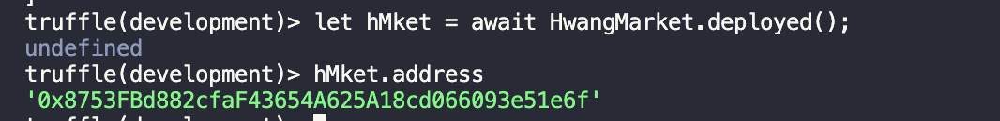
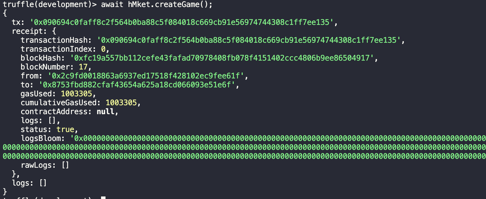
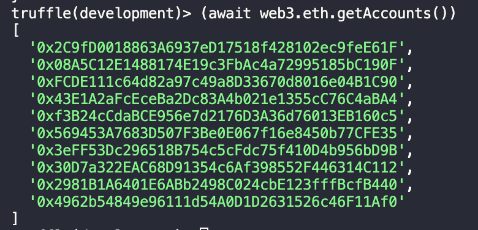

# HwangMarket

## IMPT notes:

After updating your contracts, remember to update the contract address in frontend/util/interact.js
and also run the helper script with `python3 helper.py` in the root to move the newly compiled contract's ABI to be referenced, otherwise you would still be working with the old contract ABI.

## Truffle cmds

To send some test eth to another wallet:
`truffle(development)> web3.eth.sendTransaction({to: "0xb50b7E6629901979580a440B8C066122506Ed7ae", from: accounts[0], value: web3.utils.toWei("50", "ether")});`

## Truffle & Ganache

Truffle - a development environment utilizing the EVM (Ethereum Virtual Machine) as a basis.

Ganache - tool to set up your own local Ethereum blockchain that you can use to deploy and test your smart contracts/dApps before launching them on an authentic chain.

1. Download Ganache UI: https://trufflesuite.com/ganache/

   - Once downloaded, create an Ethereum workspace

2. Install Truffle and Ganache:

```
npm install -g truffle
npm install ganache
```

3. Configuring Truffle to connect to Ganache

   - Edit `truffle-config.js` to point to Ganache's IP and port
     

4. Link the Ganache instance to Truffle Project

   - Enter the settings
     

   - Add Project under 'Workspace' section, selecting `truffle-config.js` in the Truffle project
     

# Usage

Here, we document how the contract interactions are meant to be set up. The interactions should be built out in such a way where they can be reached programatically, without any magic "address" appearing out of thin air, wherever applicable, I will try to point out prerequisites which the frontend will need to store for certain interactions, and how it can achieve the prerequisites.
There are a few milestones we want to demonstrate for the main contract, and game contract.

### Main contract

1. Players should be able to create a new game, customizing it to a certain degree.
2. We should be able to fetch all games, making a distinction between games that are ongoing and closed.
3. Players should be able to exchange ETH to purchase HMTKN.
4. Players should be able to cash out HMTKN back to ETH.
5. We should be able to get all listings where users are looking to exchange HMTKN for some game's "side" token.
6. Players should be able to create a listing to exchange HMTKN for a game's "side" token.
7. Players should be able to partake in a listing as a willing buyer, to exchange their game's side token for HMTKN.
8. We should be able to fetch all transactions recorded for display in a transparent market.
9. We should be able to fetch all transactions for a player. (BET, WITHDRAW activities)

### Game contract

1. Players should be to able join a game by purchasing tokens from initial pool, specifying the bet side.
2. Players should be able to list their game tokens to exchange for HMTKN.
3. Players should be able to partake in a listing by other players to exchange HMTKN for the game tokens.
4. The game outcome should be auto resolved by an oracle.
5. Players should be able to exchange the winning tokens back to HMTKN / collect their winnings.
6. We should be able to fetch all current player's listings for a game.
7. We should be able to get the bet ratio for both sides for a game.
8. We should be able to get all transactions relating to the game. (BET, WITHDRAW)

### Demonstration

Since the above goals cannot really be shown as independent steps, it will make more sense to show them sequentially, mimicking how the interactions are supposed to be called in real life.

The demonstration here is ran on the goerli network, and so the games are created with no intention to resolve them as we do not have a fork of chainlink oracle running on our local network. However, I will still show the steps dependent on a resolved game by implementing a backdoor function, which is not part of the deployed code, allowing me to resolve the game. Again, this function is removed after this demonstration, and is not part of the actual deployed contract.

Also, unless otherwise, all below functions are ran in the truffle development console.

```
truffle console
```

Deploy the contract. (Again a gentle reminder, you will not be able to perform the steps which requires the game to be resolved, unless you deploy on the goerli network or edit the contract code to include a backdoor like in this demo.)

```
deploy
```

Before proceeding, we establish 2 players, John and Sandy, both of which are funded accounts.

```
truffle(development)> const John = accounts[0];
undefined
truffle(development)> const Sandy = accounts[1];
undefined

truffle(development)> (await web3.eth.getBalance(John)).toString();
'94580785199999989050'
truffle(development)> (await web3.eth.getBalance(Sandy)).toString();
'99928175379999988450'
```

1. Obtain the deployed contract.

```
truffle(development)> let m = await HwangMarket.deployed();
```

2. Create a new fake game with the following settings:
   Game Resolve Time: 1919136291 (Friday, October 25, 2030 1:24:51 PM GMT+08:00)
   Oracle Address: (We lazily assign it to accounts[2], obviously its not an oracle, but we have no intention to resolve this game via chainlink oracle.)
   Threshold: 1000
   Game Tag: Price Feeds
   Title: Testing game 123

```
truffle(development)> m.createGame(1919136291, accounts[2], 1000, "Price Feeds", "Testing game 123");

// obtain a reference to the game just created, we start counting from game id of 1.
truffle(development)> let g = await GameContract.at((await m.gameContractRegistry(1)).addr);

// Alternatively, if we want to list all the games.
truffle(development)> m.getAllGames();
[
  [
    [
      '1',
      '0xd8104b4a741b00EE7D03189008d0bd6bf497cF8c',
      'Price Feeds',
      'Testing game 123',
      '0xA50B3795732c3C7C94333fB36ac2474fe5eeADd9',
      '1919136291',
      '1000',
      '0',
      '0',
      '0',
      true,
      '0',
      id: '1',
      addr: '0xd8104b4a741b00EE7D03189008d0bd6bf497cF8c',
      tag: 'Price Feeds',
      title: 'Testing game 123',
      oracleAddr: '0xA50B3795732c3C7C94333fB36ac2474fe5eeADd9',
      resolveTime: '1919136291',
      threshold: '1000',
      totalAmount: '0',
      betYesAmount: '0',
      betNoAmount: '0',
      ongoing: true,
      gameOutcome: '0'
    ]
  ],
  [],
  ongoingGames: [
    [
      '1',
      '0xd8104b4a741b00EE7D03189008d0bd6bf497cF8c',
      'Price Feeds',
      'Testing game 123',
      '0xA50B3795732c3C7C94333fB36ac2474fe5eeADd9',
      '1919136291',
      '1000',
      '0',
      '0',
      '0',
      true,
      '0',
      id: '1',
      addr: '0xd8104b4a741b00EE7D03189008d0bd6bf497cF8c',
      tag: 'Price Feeds',
      title: 'Testing game 123',
      oracleAddr: '0xA50B3795732c3C7C94333fB36ac2474fe5eeADd9',
      resolveTime: '1919136291',
      threshold: '1000',
      totalAmount: '0',
      betYesAmount: '0',
      betNoAmount: '0',
      ongoing: true,
      gameOutcome: '0'
    ]
  ],
  closedGames: []
]
```

3. Let John and Sandy purchase some HMTKN using ETH, to join the above game.

Obtain the main token contract.

```
truffle(development)> let t = await MainToken.at((await m.mainTokenAddress()));
```

Mint 1000 HMTKN for John and Sandy, the exchange rate is 1 HKMTN = 1 wei, vice versa.

```
truffle(development)> t.mint(John, 1000, 1000, {from: John, value: 1000});
truffle(development)> t.mint(Sandy, 1000, 1000, {from: Sandy, value: 1000});

truffle(development)> (await t.balanceOf(John)).toString();
'1000'
truffle(development)> (await t.balanceOf(Sandy)).toString();
'1000'
```

4. Referencing the game created in step 2, John purchases 500 token of GameYesToken, Sandy purchases 500 token of GameNoToken.

Before being able to join the game, John and Sandy must approve the corresponding HMTKN to be swapped for the game token.

```
truffle(development)> t.approve(g.address, 500, {from: John});
truffle(development)> t.approve(g.address, 500, {from: Sandy});
```

Now, we can try to join the game.

> Note: In this case, the last parameter refers to the bet side, where 1 = Yes, 2 = No. We will see this idea applied throughout our code.

```
truffle(development)> g.addPlayer(John, 500, 1);
truffle(development)> g.addPlayer(Sandy, 500, 2);
```

Obtain a reference to the GameYesToken and GameNoToken contract, so we can check if the balance has been correctly updated. This is not required, just for our own confirmation.

```
truffle(development)> let gyt = await GameERC20Token.at((await g.gameYesTokenContractAddress()));

truffle(development)> let gnt = await GameERC20Token.at((await g.gameNoTokenContractAddress()));

// Sanity check
truffle(development)> (await gyt.balanceOf(John)).toString();
'500'
truffle(development)> (await gyt.balanceOf(Sandy)).toString();
'0'
truffle(development)> (await gnt.balanceOf(John)).toString();
'0'
truffle(development)> (await gnt.balanceOf(Sandy)).toString();
'500'
```

5. Before, we proceed to game resolution, we show how John could list 100 of his GameYesToken for this particular game up, asking for 150 HMTKN in exchange.

```
truffle(development)> gyt.listUpTokensForExchange(100, t.address, 150);
```

Now, we can get the newly created listing info. Note, on the frontend we should be able to receive the struct / rely on emit of NewListing. Alternatively, we can just query all the latest listings under the game like below.

```
truffle(development)> g.getAllListings();
[
  [
    '0',
    '0x0e88bA8E659A4d0cf16b504B8Ca20cdD139b7e90',
    '0xc55De8931433adB28eE7767782E716dD00F7DEd9',
    '0x93116b6d4129739f64eE96C4C46d43f217409ba3',
    '100',
    '0x0000000000000000000000000000000000000000',
    '0xEa4Fb6E0a758EF5aEC01CB05DF94F7B5a433072c',
    '150',
    false,
    listingId: '0',
    listingAddr: '0x0e88bA8E659A4d0cf16b504B8Ca20cdD139b7e90',
    player1: '0xc55De8931433adB28eE7767782E716dD00F7DEd9',
    token1: '0x93116b6d4129739f64eE96C4C46d43f217409ba3',
    token1Amt: '100',
    player2: '0x0000000000000000000000000000000000000000',
    token2: '0xEa4Fb6E0a758EF5aEC01CB05DF94F7B5a433072c',
    token2Amt: '150',
    fulfilled: false
  ]
]
```

6. Now, suppose Sandy, is interested in the listing that John listed above. She can partake in the listing as a willing buyer, assuming she owns token 2 with the right amount.

In the above listing, token 2 is a HMTKN.

```
truffle(development)> t.address
'0xEa4Fb6E0a758EF5aEC01CB05DF94F7B5a433072c'
```

But assuming we do not know this ahead of time, we can use the IListableToken interface which HMTKN and game tokens implement to simplify the process. Below shows a generic case to partake in all listings in HwangMarket.

> Note, IListableToken is completely optional and it is fully possible to use only IERC20 compliant tokens for exchange. But implementing IListableToken greatly simplifies the process on the frontend, albeit it is more specific to HwangMarket use case. In general, it combines the approval and creation of listing / fulfilling a listing step into a single step, again purely for convenience and doing without it is also ok.

```
truffle(development)> let li = (await g.getAllListings())[0];

truffle(development)> let t2Swap = await IListableToken.at(li.token2);

truffle(development)> t2Swap.acceptTokenExchange(li.listingAddr, {from: Sandy});

truffle(development)> g.getAllListings();
[
  [
    '0',
    '0x0e88bA8E659A4d0cf16b504B8Ca20cdD139b7e90',
    '0xc55De8931433adB28eE7767782E716dD00F7DEd9',
    '0x93116b6d4129739f64eE96C4C46d43f217409ba3',
    '100',
    '0xc7997A1c60d610609fd6Fb4bD54c266511e313D0',
    '0xEa4Fb6E0a758EF5aEC01CB05DF94F7B5a433072c',
    '150',
    true,
    listingId: '0',
    listingAddr: '0x0e88bA8E659A4d0cf16b504B8Ca20cdD139b7e90',
    player1: '0xc55De8931433adB28eE7767782E716dD00F7DEd9',
    token1: '0x93116b6d4129739f64eE96C4C46d43f217409ba3',
    token1Amt: '100',
    player2: '0xc7997A1c60d610609fd6Fb4bD54c266511e313D0',
    token2: '0xEa4Fb6E0a758EF5aEC01CB05DF94F7B5a433072c',
    token2Amt: '150',
    fulfilled: true
  ]
]
```

Perform a confirmation check. Recall, the trade listing is 100 GameYesToken from John for 150 HMTKN from Sandy.

Printing out John's and Sandy's balances in all the tokens we have created:

```
truffle(development)> (await t.balanceOf(John)).toString();
'650'
truffle(development)> (await gyt.balanceOf(John)).toString();
'400'
truffle(development)> (await gnt.balanceOf(John)).toString();
'0'
truffle(development)> (await t.balanceOf(Sandy)).toString();
'350'
truffle(development)> (await gyt.balanceOf(Sandy)).toString();
'100'
truffle(development)> (await gnt.balanceOf(Sandy)).toString();
'500'
```

7. Now, usually there would be a chainlink job scheduler to call the game's `performUpkeep` function to trigger the resolution. However, for this demo, we will be using a backdoor function which mimicks the game resolution part. For obvious reasons, this will be left out the actual deployed contract. If you wish to follow along this demo yourself, you would need to include this function in `GameContract.sol` and repeat the above steps. The code for the backdoor function is:

```
// this is only part of the demo to bypass no chainlink oracle on local
// this is removed in actual deployed contract
function backdoor(int256 price) external {
  status = GameStatus.CLOSED;
  gameSide side = gameSide.NO;
  uint8 rawSide = 2;
  if (price >= threshold) {
    side = gameSide.YES;
    rawSide = 1;
  }
  gameOutcome = side;

  // also, disable gameResolveTime for other assertions
  gameResolveTime = block.timestamp;

  mainContract.concludeGame(rawSide);
}
```

We now backdoor a conclusion of the game's final price reaching 1000, meaning it is resolved with a outcome of YES.

```
truffle(development)> g.backdoor(1000);

// Returns: (creator, status, gameOutcome, gameResolveTime, threshold);
truffle(development)> g.getGameInfo();
Result {
  '0': '0xCEC383D0C69265D996063D2536adf60BC8708f76',
  '1': BN {
    negative: 0,
    words: [ 1, <1 empty item> ],
    length: 1,
    red: null
  },
  '2': BN {
    negative: 0,
    words: [ 1, <1 empty item> ],
    length: 1,
    red: null
  },
  '3': BN {
    negative: 0,
    words: [ 0, <1 empty item> ],
    length: 1,
    red: null
  },
  '4': BN {
    negative: 0,
    words: [ 1000, <1 empty item> ],
    length: 1,
    red: null
  }
}
```

8. Once a game is concluded, players can collect their winnings by exchanging in their winning game tokens for their corresponding winning in terms of HMTKN.

> The formula for winnings calculation is:
> Winnings (in HwangMarket Token) = (((Game1YesToken traded in) / (Total pool of Game1YesToken owned by other players, NOT by the game)) \* (Total pool of HwangMarket Token placed on losing side)) + (Amount of Game1YesToken traded in, in terms of HwangMarket Token).

Suppose, Sandy wants to trade in her 100 GameYesToken. She has to first approve the game contract as a spender for the 100 GameYesToken.

```
truffle(development)> gyt.approve(g.address, 100, {from: Sandy});
```

Next, Sandy can withdraw her winnings.

```
truffle(development)> g.withdrawWinnings(100, {from: Sandy});
```

John can also withdraw his 400 GameYesToken.

```
truffle(development)> gyt.approve(g.address, 400, {from: John});
truffle(development)> g.withdrawWinnings(400, {from: John});
```

To confirm, we now check their HMTKN balances and their GameYesToken balances.

```
truffle(development)> (await t.balanceOf(John)).toString();
'1050'
truffle(development)> (await t.balanceOf(Sandy)).toString();
'450'
truffle(development)> (await gyt.balanceOf(John)).toString();
'0'
truffle(development)> (await gyt.balanceOf(Sandy)).toString();
'0'
```

John's HMTKN balance = 500 + 150 (from trade earlier) + (4/5) x 500 = 1050.
Sandy's HMTKN balance = 500 - 150 (from trade earlier) + (1/5) x 500 = 450.

As we can see, the math checks out.

9. Also, we can view all transactions related to the game.

```
truffle(development)> g.getTrxs();
[
  [
    '0',
    'BET',
    '500',
    '1666698864',
    '1',
    '0xd8104b4a741b00EE7D03189008d0bd6bf497cF8c',
    '0xc55De8931433adB28eE7767782E716dD00F7DEd9',
    trxId: '0',
    activityType: 'BET',
    trxAmt: '500',
    trxTime: '1666698864',
    gameSide: '1',
    from: '0xd8104b4a741b00EE7D03189008d0bd6bf497cF8c',
    to: '0xc55De8931433adB28eE7767782E716dD00F7DEd9'
  ],
  [
    '1',
    'BET',
    '500',
    '1666698868',
    '2',
    '0xd8104b4a741b00EE7D03189008d0bd6bf497cF8c',
    '0xc7997A1c60d610609fd6Fb4bD54c266511e313D0',
    trxId: '1',
    activityType: 'BET',
    trxAmt: '500',
    trxTime: '1666698868',
    gameSide: '2',
    from: '0xd8104b4a741b00EE7D03189008d0bd6bf497cF8c',
    to: '0xc7997A1c60d610609fd6Fb4bD54c266511e313D0'
  ],
  [
    '2',
    'WITHDRAW',
    '100',
    '1666698993',
    '1',
    '0xd8104b4a741b00EE7D03189008d0bd6bf497cF8c',
    '0xc7997A1c60d610609fd6Fb4bD54c266511e313D0',
    trxId: '2',
    activityType: 'WITHDRAW',
    trxAmt: '100',
    trxTime: '1666698993',
    gameSide: '1',
    from: '0xd8104b4a741b00EE7D03189008d0bd6bf497cF8c',
    to: '0xc7997A1c60d610609fd6Fb4bD54c266511e313D0'
  ],
  [
    '3',
    'WITHDRAW',
    '400',
    '1666699002',
    '1',
    '0xd8104b4a741b00EE7D03189008d0bd6bf497cF8c',
    '0xc55De8931433adB28eE7767782E716dD00F7DEd9',
    trxId: '3',
    activityType: 'WITHDRAW',
    trxAmt: '400',
    trxTime: '1666699002',
    gameSide: '1',
    from: '0xd8104b4a741b00EE7D03189008d0bd6bf497cF8c',
    to: '0xc55De8931433adB28eE7767782E716dD00F7DEd9'
  ]
```

10. Finally, suppose John and Sandy now wishes to cash out all their HMTKN back to ETH.

But first, lets capture their latest balance, so we can confirm that ETH was indeed deposited in exchange for their HMTKN.

```
truffle(development)> (await web3.eth.getBalance(John)).toString();
'94410073039999988050'
truffle(development)> (await web3.eth.getBalance(Sandy)).toString();
'99912861539999987450'
truffle(development)> (await t.balanceOf(John)).toString();
'1050'
truffle(development)> (await t.balanceOf(Sandy)).toString();
'450'
```

Now, cash out.

```
truffle(development)> t.cashout(1050, {from: John});
truffle(development)> t.cashout(450, {from: Sandy});
```

Check the final balance.

```
truffle(development)>  (await web3.eth.getBalance(John)).toString();
'94409414079999989100'
truffle(development)> (await web3.eth.getBalance(Sandy)).toString();
'99912202579999987900'
truffle(development)> (await t.balanceOf(John)).toString();
'0'
truffle(development)> (await t.balanceOf(Sandy)).toString();
'0'
```

11. Finally, we can also view the game from earlier is closed.

```
truffle(development)> m.getAllGames();
truffle(development)> m.getAllGames();
[
  [],
  [
    [
      '1',
      '0xd8104b4a741b00EE7D03189008d0bd6bf497cF8c',
      'Price Feeds',
      'Testing game 123',
      '0xA50B3795732c3C7C94333fB36ac2474fe5eeADd9',
      '1919136291',
      '1000',
      '0',
      '0',
      '0',
      false,
      '1',
      id: '1',
      addr: '0xd8104b4a741b00EE7D03189008d0bd6bf497cF8c',
      tag: 'Price Feeds',
      title: 'Testing game 123',
      oracleAddr: '0xA50B3795732c3C7C94333fB36ac2474fe5eeADd9',
      resolveTime: '1919136291',
      threshold: '1000',
      totalAmount: '0',
      betYesAmount: '0',
      betNoAmount: '0',
      ongoing: false,
      gameOutcome: '1'
    ]
  ],
  ongoingGames: [],
  closedGames: [
    [
      '1',
      '0xd8104b4a741b00EE7D03189008d0bd6bf497cF8c',
      'Price Feeds',
      'Testing game 123',
      '0xA50B3795732c3C7C94333fB36ac2474fe5eeADd9',
      '1919136291',
      '1000',
      '0',
      '0',
      '0',
      false,
      '1',
      id: '1',
      addr: '0xd8104b4a741b00EE7D03189008d0bd6bf497cF8c',
      tag: 'Price Feeds',
      title: 'Testing game 123',
      oracleAddr: '0xA50B3795732c3C7C94333fB36ac2474fe5eeADd9',
      resolveTime: '1919136291',
      threshold: '1000',
      totalAmount: '0',
      betYesAmount: '0',
      betNoAmount: '0',
      ongoing: false,
      gameOutcome: '1'
    ]
  ]
]
```

12. Also, we can view all activities related to John and Sandy at the level of HwangMarket.

```
truffle(development)> m.getPlayersTrxRecords(John);
[
  [
    '0',
    'BET',
    '1',
    '500',
    '1666698864',
    '1',
    '0xc55De8931433adB28eE7767782E716dD00F7DEd9',
    '0xd8104b4a741b00EE7D03189008d0bd6bf497cF8c',
    trxId: '0',
    activityType: 'BET',
    gameId: '1',
    trxAmt: '500',
    trxTime: '1666698864',
    gameSide: '1',
    from: '0xc55De8931433adB28eE7767782E716dD00F7DEd9',
    to: '0xd8104b4a741b00EE7D03189008d0bd6bf497cF8c'
  ],
  [
    '3',
    'WITHDRAW',
    '1',
    '400',
    '1666699002',
    '1',
    '0xd8104b4a741b00EE7D03189008d0bd6bf497cF8c',
    '0xc55De8931433adB28eE7767782E716dD00F7DEd9',
    trxId: '3',
    activityType: 'WITHDRAW',
    gameId: '1',
    trxAmt: '400',
    trxTime: '1666699002',
    gameSide: '1',
    from: '0xd8104b4a741b00EE7D03189008d0bd6bf497cF8c',
    to: '0xc55De8931433adB28eE7767782E716dD00F7DEd9'
  ]
]
```

```
truffle(development)> m.getPlayersTrxRecords(Sandy);
[
  [
    '1',
    'BET',
    '1',
    '500',
    '1666698868',
    '2',
    '0xc7997A1c60d610609fd6Fb4bD54c266511e313D0',
    '0xd8104b4a741b00EE7D03189008d0bd6bf497cF8c',
    trxId: '1',
    activityType: 'BET',
    gameId: '1',
    trxAmt: '500',
    trxTime: '1666698868',
    gameSide: '2',
    from: '0xc7997A1c60d610609fd6Fb4bD54c266511e313D0',
    to: '0xd8104b4a741b00EE7D03189008d0bd6bf497cF8c'
  ],
  [
    '2',
    'WITHDRAW',
    '1',
    '100',
    '1666698993',
    '1',
    '0xd8104b4a741b00EE7D03189008d0bd6bf497cF8c',
    '0xc7997A1c60d610609fd6Fb4bD54c266511e313D0',
    trxId: '2',
    activityType: 'WITHDRAW',
    gameId: '1',
    trxAmt: '100',
    trxTime: '1666698993',
    gameSide: '1',
    from: '0xd8104b4a741b00EE7D03189008d0bd6bf497cF8c',
    to: '0xc7997A1c60d610609fd6Fb4bD54c266511e313D0'
  ]
]
```

# Everything below is outdated, it might or might not be accurate but is left in as it might contain helpful commands.

# Developing on local

#### 1. Enter developement console:

```
truffle console
```

#### 2. Compiling contracts ABI:

```
truffle(development)> compile
```

#### 3. Deploying to local ganache:

```
truffle(development)> migrate
```

#### 4. Deploying main HwangMarket contract

```
truffle(development)> let hMket = await HwangMarket.deployed();
undefined
```



> Noob note: Returned output is undefined, but if you just enter hMket, you will see it is indeed deployed. It is only a problem if you get an error here. Obviously, you can also interact with the contract instance here, such as finding out its address and balance, etc.

#### 5. Create a new game contract via HwangMarket main contract

Call the createGame method. You can confirm the trx hash being returned.

```
truffle(development)> await hMket.createGame();
```



#### 6. Get the address of the game contract that was just created.

To get the address of the game contract that was just created, we need to reference the HwangMarket main contract's public map `gameContractRegistry`.

```
truffle(development)> hMket.gameContractRegistry(0);
'0x625a021D3aa2Bf3E26eA455e3cF2e1AD7C83554D'
```

Alternatively, if you like pineapples on your pizzas,

```
truffle(development)> hMket.methods["gameContractRegistry(uint256)"].call(0);
'0x625a021D3aa2Bf3E26eA455e3cF2e1AD7C83554D'
```

#### 7. Get an instance of the game contract that was just created.

```
let gamba = await GameContract.at('0x625a021D3aa2Bf3E26eA455e3cF2e1AD7C83554D');
```

#### 8. Invoking the game contract's methods.

```
truffle(development)> gamba.getBalance();
BN { negative: 0, words: [ 0, <1 empty item> ], length: 1, red: null }
```

Now, lets see how we can play around in this test env, but first we need some funded accounts to play with. We can try to top up this game contract's balance.
To get a list of the funded local accounts available, each having 100 eth, we can run: `await web3.eth.getAccounts()`. This will be useful in getting some already funded accounts so we can just focus on development.


Below, shows a quick way to top up the `gamba` contract balance amount.

```
truffle(development)> gamba.getBalance();
BN { negative: 0, words: [ 0, <1 empty item> ], length: 1, red: null }

truffle(development)> const John = (await web3.eth.getAccounts())[0];
undefined

truffle(development)> gamba.sendTransaction({from: John, value:21})
{
  tx: '0x4d85042b958a82e9ae2ea421cdd76062bb4fde5eb4c007ee99c3e5ef2e034fdb',
  receipt: {
    transactionHash: '0x4d85042b958a82e9ae2ea421cdd76062bb4fde5eb4c007ee99c3e5ef2e034fdb',
    transactionIndex: 0,
    blockHash: '0xe27168428629c66cc6bdb9f1466f81bc7f580e990e0a656d86e58649b3d36e8d',
    blockNumber: 18,
    from: '0x2c9fd0018863a6937ed17518f428102ec9fee61f',
    to: '0x8b459607ef7b1e64f7c66e94920305b7d3ed37af',
    gasUsed: 21055,
    cumulativeGasUsed: 21055,
    contractAddress: null,
    logs: [],
    status: true,
    logsBloom: '0x00000000000000000000000000000000000000000000000000000000000000000000000000000000000000000000000000000000000000000000000000000000000000000000000000000000000000000000000000000000000000000000000000000000000000000000000000000000000000000000000000000000000000000000000000000000000000000000000000000000000000000000000000000000000000000000000000000000000000000000000000000000000000000000000000000000000000000000000000000000000000000000000000000000000000000000000000000000000000000000000000000000000000000000000000000000',
    rawLogs: []
  },
  logs: []
}

truffle(development)> await gamba.getBalance();
BN { negative: 0, words: [ 21, <1 empty item> ], length: 1, red: null }
```

#### Adding a player to YES side.

```
truffle(development)> const ga = await GameContract.at('0xf4A41837A929bc9Aea65085a6cf71969B9514bF8');
undefined
truffle(development)> ga.getSideAmt(0);
BN { negative: 0, words: [ 0, <1 empty item> ], length: 1, red: null }
truffle(development)> ga.getSideAmt(1);
BN { negative: 0, words: [ 0, <1 empty item> ], length: 1, red: null }
truffle(development)> ga.addPlayer(John, 21, 1, {value: 21});
{
  tx: '0xbb0a0543dfe81b446ec4befd2e916072996ffe92238d138b42f208ed694c8cef',
  receipt: {
    transactionHash: '0xbb0a0543dfe81b446ec4befd2e916072996ffe92238d138b42f208ed694c8cef',
    transactionIndex: 0,
    blockHash: '0x2b368d14d84affc466e088f9cd733f9e001a3b53e5c67c7518a93ee155e367a0',
    blockNumber: 36,
    from: '0x2c9fd0018863a6937ed17518f428102ec9fee61f',
    to: '0xf4a41837a929bc9aea65085a6cf71969b9514bf8',
    gasUsed: 86624,
    cumulativeGasUsed: 86624,
    contractAddress: null,
    logs: [],
    status: true,
    logsBloom: '0x00000000000000000000000000000000000000000000000000000000000000000000000000000000000000000000000000000000000000000000000000000000000000000000000000000000000000000000000000000000000000000000000000000000000000000000000000000000000000000000000000000000000000000000000000000000000000000000000000000000000000000000000000000000000000000000000000000000000000000000000000000000000000000000000000000000000000000000000000000000000000000000000000000000000000000000000000000000000000000000000000000000000000000000000000000000',
    rawLogs: []
  },
  logs: []
}
truffle(development)> ga.getSideAmt(1);
BN { negative: 0, words: [ 21, <1 empty item> ], length: 1, red: null }
truffle(development)> ga.getBalance();
BN { negative: 0, words: [ 21, <1 empty item> ], length: 1, red: null }
truffle(development)> ga.betRecords(John);
BN { negative: 0, words: [ 21, <1 empty item> ], length: 1, red: null }
truffle(development)> ga.betSides(John);
BN { negative: 0, words: [ 1, <1 empty item> ], length: 1, red: null }
truffle(development)> ga.getSideAmt(0);
BN { negative: 0, words: [ 0, <1 empty item> ], length: 1, red: null }
```

#### Adding another player

Since the `addPlayer` method requires that the sender is the player, you have to specify the optional from if you wish to submit on behalf of another user.

```
truffle(development)> const Sandy = (await web3.eth.getAccounts())[1];
undefined
truffle(development)> ga.addPlayer(Sandy, 13, 0, {value: 13, from: Sandy});
{
  tx: '0x21654b61a5befce01d88403dabb9fa4d3fe460684846b65e381c39ca25a3ce39',
  receipt: {
    transactionHash: '0x21654b61a5befce01d88403dabb9fa4d3fe460684846b65e381c39ca25a3ce39',
    transactionIndex: 0,
    blockHash: '0x57f12d17f807cee6bf88bdacd9eb2c4e6185d4392b5e1917bcea00a732e020d3',
    blockNumber: 37,
    from: '0x08a5c12e1488174e19c3fbac4a72995185bc190f',
    to: '0xf4a41837a929bc9aea65085a6cf71969b9514bf8',
    gasUsed: 86587,
    cumulativeGasUsed: 86587,
    contractAddress: null,
    logs: [],
    status: true,
    logsBloom: '0x00000000000000000000000000000000000000000000000000000000000000000000000000000000000000000000000000000000000000000000000000000000000000000000000000000000000000000000000000000000000000000000000000000000000000000000000000000000000000000000000000000000000000000000000000000000000000000000000000000000000000000000000000000000000000000000000000000000000000000000000000000000000000000000000000000000000000000000000000000000000000000000000000000000000000000000000000000000000000000000000000000000000000000000000000000000',
    rawLogs: []
  },
  logs: []
}
truffle(development)> ga.getSideAmt(0);
BN { negative: 0, words: [ 13, <1 empty item> ], length: 1, red: null }
truffle(development)> ga.getSideAmt(1);
BN { negative: 0, words: [ 21, <1 empty item> ], length: 1, red: null }
```

## Connecting to Goerli test network

#### 1. Run the truffle console in goerli network.

Already configured in `truffle-config.js`. You only need to run:

```
npx truffle console --network goerli
```

This is useful for connecting to chainlink, since using chainlink in local ganache requires us forking the block and running it locally on our network.

#### 2. Top up your test wallet.

First, check your wallet's balance, which should be zero initially. Then, request for a top up in [goerli faucet](https://goerlifaucet.com/).

Paste the following address into the wallet address input on goerli faucet.

```
❯ npx truffle console --network goerli
truffle(goerli)> await web3.eth.getBalance(accounts[0])
'0'
truffle(goerli)> accounts[0]
'0x6Fe9af369bF80b2D18f66a5606383a5f8f83eC9B'

// after getting some goerli eth
truffle(goerli)> await web3.eth.getBalance(accounts[0])
'100000000000000000'
```

#### 3. Developing on the testnet

Just run `compile` and `migrate` to compile and deploy the contract like in local ganache.

```
truffle(goerli)> compile

Compiling your contracts...
===========================
> Compiling ./contracts/GameContract.sol
> Compiling ./contracts/HwangMarket.sol
> Compilation warnings encountered:

    Warning: Visibility for constructor is ignored. If you want the contract to be non-deployable, making it "abstract" is sufficient.
  --> project:/contracts/HwangMarket.sol:12:3:
   |
12 |   constructor() public {
   |   ^ (Relevant source part starts here and spans across multiple lines).


> Artifacts written to /Users/gerald/Desktop/HwangMarket/build/contracts
> Compiled successfully using:
   - solc: 0.8.17+commit.8df45f5f.Emscripten.clang
truffle(goerli)> migrate

Compiling your contracts...
===========================
> Everything is up to date, there is nothing to compile.


Starting migrations...
======================
> Network name:    'goerli'
> Network id:      5
> Block gas limit: 30000000 (0x1c9c380)


2_deploy_contracts.js
=====================

   Deploying 'HwangMarket'
   -----------------------
   > transaction hash:    0x7ea92d9eb1314fa62550b44ce11209647b4c25716730c6b6c8ca002fb03b1f64
   > Blocks: 2            Seconds: 25
   > contract address:    0x0b0A553581c91FB635e8D28C9b8a8D4C8273A456
   > block number:        7791142
   > block timestamp:     1666099032
   > account:             0x6Fe9af369bF80b2D18f66a5606383a5f8f83eC9B
   > balance:             0.09047221062612016
   > gas used:            1567776 (0x17ec20)
   > gas price:           6.077264465 gwei
   > value sent:          0 ETH
   > total cost:          0.00952778937387984 ETH

   Pausing for 2 confirmations...

   -------------------------------
   > confirmation number: 1 (block: 7791143)
   > confirmation number: 2 (block: 7791144)
   > Saving artifacts
   -------------------------------------
   > Total cost:     0.00952778937387984 ETH

Summary
=======
> Total deployments:   1
> Final cost:          0.00952778937387984 ETH

```

You can also view the above trx on etherscan for goerli:
https://goerli.etherscan.io/tx/0x7ea92d9eb1314fa62550b44ce11209647b4c25716730c6b6c8ca002fb03b1f64

#### Getting the latest price of ETH / USD from chainlink

```
truffle(goerli)>  ( await gamba.getLatestPrice()).toString();
'133160765596'
truffle(goerli)>  ( await gamba.getLatestPrice()).toString();
'132482575965'
```

The value is repesented with 8 decimal points and the price only updates when a 1% deviation is recorded. Reference for other price feeds on goerli testnet:
https://docs.chain.link/docs/data-feeds/price-feeds/addresses/

### An example run on local dev network.

1. Enter the truffle console, all commands below, unless otherwise stated will be ran in console.

```
truffle console
```

2. Compile and deploy

```
migrate
```

3. Obtain main hwang market contract deployed.

```
  let m = await HwangMarket.deployed();
```

Confirm by getting address of the deployed contract:

```
m.address
```

4. Get address of main token.

```
let a = await m.mainToken()
```

5. Obtain an instance of the main token contract.

```
let t = await MainToken.at(a);
```

Again, you can confirm the instance is loaded into `t` properly by running `t.address`.

6. Select one of the funded test accounts to be our player. We name him `John` in this example.

```
const John = accounts[0];
```

We can also check John's balance in wei by running:

```
await web3.eth.getBalance(John);
```

7. Make John to exchange eth to the main token. In this case, we trade in 1000 wei for 1000 HMTKN.

```
t.mint(John, 1000, 1000, {from: John, value: 1000});
```

8. Create a fake game for John to participate to in.
   If you were to check the params passed in, this is obviously a fake game, and the timestamp used is sometime in the year 2099, the oracle address is simply using one of the account's address and is not an oracle but I have no intention of resolving the game in this example. In reality, you are supposed to actually pass in an oracle address.

```
m.createGame(4097039164, accounts[2], 1000, "a", "a");
```

9. Get the game's address for which we just created.

```
a = (await m.gameContractRegistry(1)).addr
```

10. Obtain an instance of the game contract we just created at that address.

```
let g = await GameContract.at(a);
```

Again, you can get its address to confirm.

11. John now purchase 500 tokens on side YES (1).
    Creating the game will also deploy 2 other game tokens with finite supply. Essentially, what John does is purchase 500 GameYesTokens freshly minted for John. In our project, we equate 1 HMTKN to be equal to 1 GameToken, for all games, for either sides.
    However, John has to first authorize transfer of 500 HMTKN to the game's address. This can be done via the following command:

```
t.approve(g.address, 500);
```

Now, John can initiate the purchase of 500 tokens for the game's YES side.

```
g.addPlayer(John, 500, 1);
```

Note: Skipping approval, there will be an error returned, which is the correct behaviour under ERC20 token standard.

```
Error: Returned error: VM Exception while processing transaction: revert player's hwang market token allowance too low
```

12. We can confirm that John has received the 500 GameYesToken by checking it directly:

```
truffle(development)> a = await g.gameYesTokenContract();
'0x0Ce7E920f71443c4522493a1F36D4F8d7C986755'
truffle(development)> let tmp = await GameERC20Token.at(a);
undefined
truffle(development)> tmp.address
'0x0Ce7E920f71443c4522493a1F36D4F8d7C986755'
truffle(development)> (await tmp.balanceOf(John)).toString();
'500'
```

13. If we try to purchase another 600 GameYesToken, an error will be thrown due to the hard 1000 game token limit imposed.
    But first, we need to mint John a few more HMTKN tokens, because we only have 500 left after the above :(.

```
t.mint(John, 1000, 1000, {from: John, value: 1000});
```

Remember to approve the trx.

```
t.approve(g.address, 600);
```

Now purchasing the remaining 600 throws an error since we can no longer mint the requested 600 amount.

```
g.addPlayer(John, 600, 1);
Error: Returned error: VM Exception while processing transaction: revert game token cannot mint requested amount
```

14. Cashing out
    Now, while John can not exchange the game token back to HMTKN until the game is over and he has won, he can exchange his HMTKN back to eth wei anytime, just like in a casino. Similar to earlier, John will have to approve the amount of HMTKN to exchange back to eth wei. In this example, we exchange back 100 HMTKN to 100 WEI, recall the exchange rate is 1-1 both way.

```
t.approve(t.address, 100);
```

Now, before running the cashout, it is good to confirm John actually receives back his WEI, get his balance first.

```
truffle(development)> await web3.eth.getBalance(John);
'98590713079999987200'
```

Now, actually execute the cashout.

```
t.cashout(John, 100);
```

Now, we can compare that the final balance of John is 100 wei richer.

```
truffle(development)> await web3.eth.getBalance(John);
'98589721779999987300'
```

# Running the entire test contract

1. Create the HwangMarket contract in goerli test net.
2. Configure accounts list to use those accounts with balance in them.

```
// replace accounts[i] with whatever you want.
truffle(goerli)> let accounts = await web3.eth.getAccounts();

// as an example
truffle(goerli)> Sandy = accounts[1]
```

3. Create the game contract and hold a reference to its instance by looking up its address in the main contract's game registry mapping.
4. Add players to any side

```
truffle(goerli)> x.addPlayer(Sandy, 3, 1, {value: 3, from: Sandy});
truffle(goerli)> x.addPlayer(accounts[0], 3, 0, {value: 3, from: accounts[0]});
```

> Note you would most likely need to specify the optional from param, since we assert that only players can self register, we cannot register on their behalf. 5. Run the perform upkeep function whenever ready.

```
truffle(goerli)> await x.performUpkeep();
```

6. Then withdraw a player's winnings whenever.

```
truffle(goerli)> await x.withdrawWinnings(Sandy);

truffle(goerli)> await web3.eth.getBalance(Sandy)
'20904606684859864'
```

Boom, we should have a basic contract that bets if ETH / USD is at least 1350 after 5 minutes when the contract is already created. The next goal would be to then focus on making contract creation more flexible since the above is only an example for what a game could look like.
